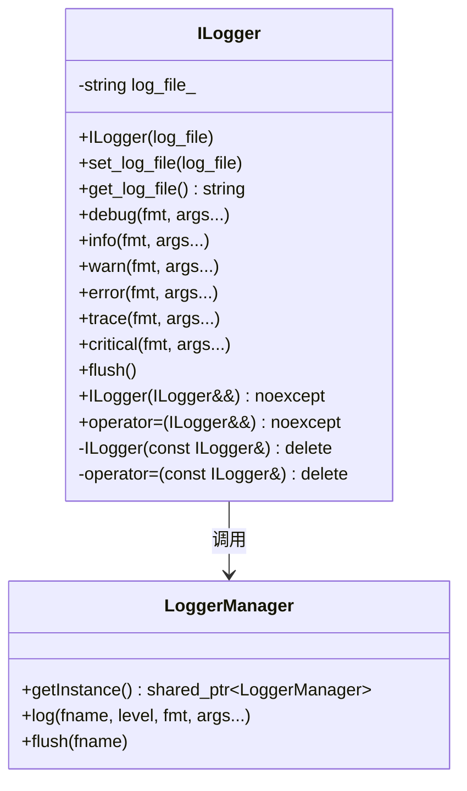
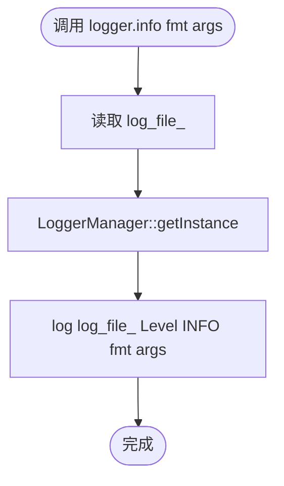
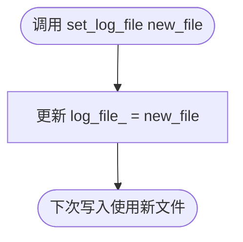
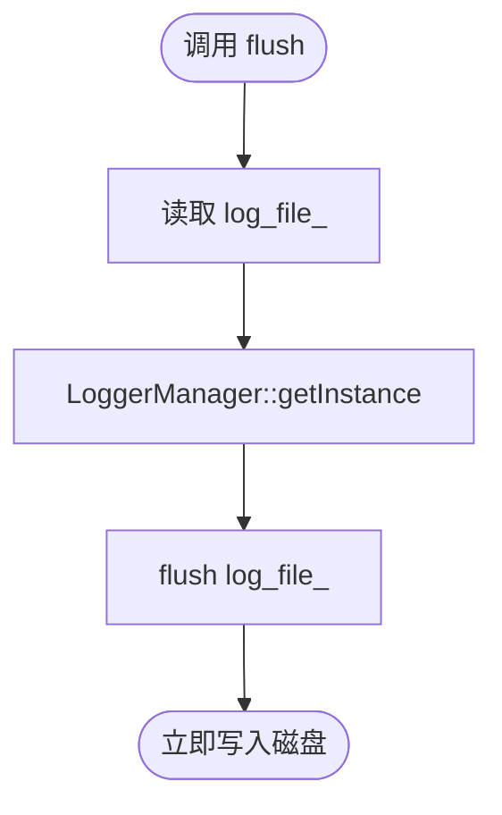

# ILogger 实现文档

## 1. 概述

`ILogger` 是对 `LoggerManager` 的轻量封装类，通过绑定日志文件名提供简化的写入接口。核心目标：

- **简化调用**：避免重复传入文件名和级别
- **模块化**：每个模块持有一个实例，写入独立日志文件
- **语义化**：方法名隐含日志级别，代码更清晰
- **移动语义**：禁止拷贝，支持移动，便于容器存储

---

## 2. 架构设计

### 2.1 类结构



### 2.2 关键成员

| 成员 | 类型 | 说明 |
|------|------|------|
| `log_file_` | `std::string` | 绑定的日志文件名（不含后缀） |
| 构造函数 | `explicit` | 绑定日志文件名 |
| 移动构造 | `noexcept` | 支持移动语义 |
| 拷贝构造 | `delete` | 禁止拷贝 |

---

## 3. 核心流程

### 3.1 写入日志流程



**关键点**：
- `log_file_` 作为固定参数传入 `LoggerManager::log()`
- 日志级别由方法名决定（`info()` → `Level::INFO`）
- 参数通过完美转发传递给 `LoggerManager`

### 3.2 切换日志文件流程



### 3.3 flush 流程



---

## 4. 实现细节

### 4.1 模板方法实现

```cpp
template<typename... Args>
void info(const std::string& fmt, Args&&... args)
{
    LoggerManager::getInstance()->log(log_file_, Level::INFO, fmt, std::forward<Args>(args)...);
}
```

**技术要点**：
- **可变参数模板**：支持任意数量的参数
- **完美转发**：`std::forward<Args>(args)...` 保持参数的值类别
- **固定级别**：`Level::INFO` 由方法名决定，无需传入

### 4.2 移动语义

```cpp
ILogger(ILogger&& other) noexcept
    : log_file_(std::move(other.log_file_))
{}

ILogger& operator=(ILogger&& other) noexcept
{
    if (this != &other) {
        log_file_ = std::move(other.log_file_);
    }
    return *this;
}
```

**设计考虑**：
- **noexcept**：移动操作不应抛出异常，便于容器优化
- **自赋值检查**：`if (this != &other)` 防止自赋值
- **std::move**：转移字符串所有权，避免拷贝

### 4.3 禁止拷贝

```cpp
ILogger(const ILogger&) = delete;
ILogger& operator=(const ILogger&) = delete;
```

**原因**：
- 语义上，多个 `ILogger` 实例不应共享同一个日志文件名
- 强制使用移动语义，明确所有权转移

---

## 5. 使用模式

### 5.1 成员变量模式

```cpp
class NetworkModule {
private:
    ILogger logger_;  // 成员变量

public:
    NetworkModule() : logger_("network") {}

    void connect(const std::string& ip) {
        logger_.info("连接中，IP={}", ip);
    }
};
```

**优势**：
- 日志文件名与模块绑定，生命周期一致
- 构造时初始化，无需额外管理

### 5.2 容器存储模式

```cpp
std::vector<ILogger> loggers;
loggers.reserve(10);

for (int i = 0; i < 10; ++i) {
    ILogger logger("worker_" + std::to_string(i));
    loggers.push_back(std::move(logger));  // 移动语义
}
```

**关键点**：
- 使用 `std::move` 避免拷贝
- 容器需要支持移动构造（`std::vector` 支持）

### 5.3 全局单例模式（不推荐）

```cpp
// 不推荐：全局变量
ILogger g_logger("app");

int main() {
    g_logger.info("程序启动");
}
```

**问题**：
- 全局变量初始化顺序不确定
- 依赖 `LoggerManager` 单例，可能导致未初始化就调用

**推荐**：使用成员变量或局部变量。

---

## 6. 性能分析

### 6.1 时间复杂度

| 操作 | 时间复杂度 | 说明 |
|------|-----------|------|
| 构造 | O(1) | 仅复制字符串 |
| 写入日志 | O(1) | 委托给 LoggerManager |
| `set_log_file()` | O(1) | 字符串赋值 |
| `flush()` | O(1) | 委托给 LoggerManager |
| 移动构造 | O(1) | 字符串移动 |

### 6.2 空间复杂度

- **实例大小**：`sizeof(std::string)`（通常 24-32 字节）
- **额外开销**：无

### 6.3 性能优化

- **inline 方法**：所有方法都在头文件中定义，编译器可内联
- **无虚函数**：避免虚表查找
- **移动语义**：避免字符串拷贝

---

## 7. 与其他方案对比

### 7.1 直接使用 LoggerManager

```cpp
// 直接使用
LoggerManager::getInstance()->log("network", Level::INFO, "连接成功");

// 使用 ILogger
ILogger logger("network");
logger.info("连接成功");
```

| 特性 | 直接使用 | ILogger |
|------|---------|---------|
| 代码简洁性 | 需每次传文件名和级别 | 简洁 |
| 类型安全 | 字符串文件名，易出错 | 类型安全 |
| 模块化 | 需全局共享文件名 | 每模块独立实例 |
| 性能 | 相同 | 相同（零开销抽象） |

### 7.2 宏定义方案

```cpp
#define LOG_INFO(file, fmt, ...) LoggerManager::getInstance()->log(file, Level::INFO, fmt, ##__VA_ARGS__)

LOG_INFO("network", "连接成功");
```

| 特性 | 宏定义 | ILogger |
|------|--------|---------|
| 类型安全 | 无 | 有 |
| 调试友好 | 宏展开难调试 | 正常函数 |
| 重载支持 | 困难 | 支持模板 |
| IDE 支持 | 无代码补全 | 有补全 |

---

## 8. 已知限制

1. **依赖 LoggerManager**：必须先初始化 `LoggerManager` 单例
2. **文件名无验证**：不检查文件名合法性，依赖 `LoggerManager` 处理
3. **无线程池配置**：无法单独配置线程池，使用全局配置
4. **无日志级别过滤**：不提供级别过滤，依赖 `LoggerManager` 全局配置

---

## 9. 测试与验证

### 9.1 单元测试示例

```cpp
#include "ilogger.h"
#include <cassert>

void test_basic_usage() {
    LoggerManager::getInstance()->set_root_dir("./test_logs");

    ILogger logger("test");
    logger.info("测试消息");

    assert(logger.get_log_file() == "test");
}

void test_set_log_file() {
    ILogger logger("network");
    assert(logger.get_log_file() == "network");

    logger.set_log_file("database");
    assert(logger.get_log_file() == "database");
}

void test_move_semantic() {
    ILogger logger1("worker1");
    ILogger logger2 = std::move(logger1);

    assert(logger2.get_log_file() == "worker1");
}

int main() {
    test_basic_usage();
    test_set_log_file();
    test_move_semantic();

    std::cout << "All tests passed!" << std::endl;
    return 0;
}
```

---

## 10. 依赖

- C++11 或更高版本（可变参数模板、完美转发、移动语义）
- `LoggerManager` 及其依赖（spdlog）
- 标准库：`<string>`

---

## 11. 扩展方向

### 11.1 支持日志级别过滤

```cpp
class ILogger {
    Level min_level_ = Level::INFO;

    template<typename... Args>
    void debug(const std::string& fmt, Args&&... args) {
        if (Level::DEBUG < min_level_) return;
        // ...
    }
};
```

### 11.2 支持异步写入开关

```cpp
class ILogger {
    bool async_ = true;

    template<typename... Args>
    void info(const std::string& fmt, Args&&... args) {
        if (!async_) {
            // 同步写入
        } else {
            // 异步写入
        }
    }
};
```

### 11.3 支持日志格式化器

```cpp
class ILogger {
    std::function<std::string(const std::string&)> formatter_;

    void set_formatter(std::function<std::string(const std::string&)> f) {
        formatter_ = f;
    }
};
```
