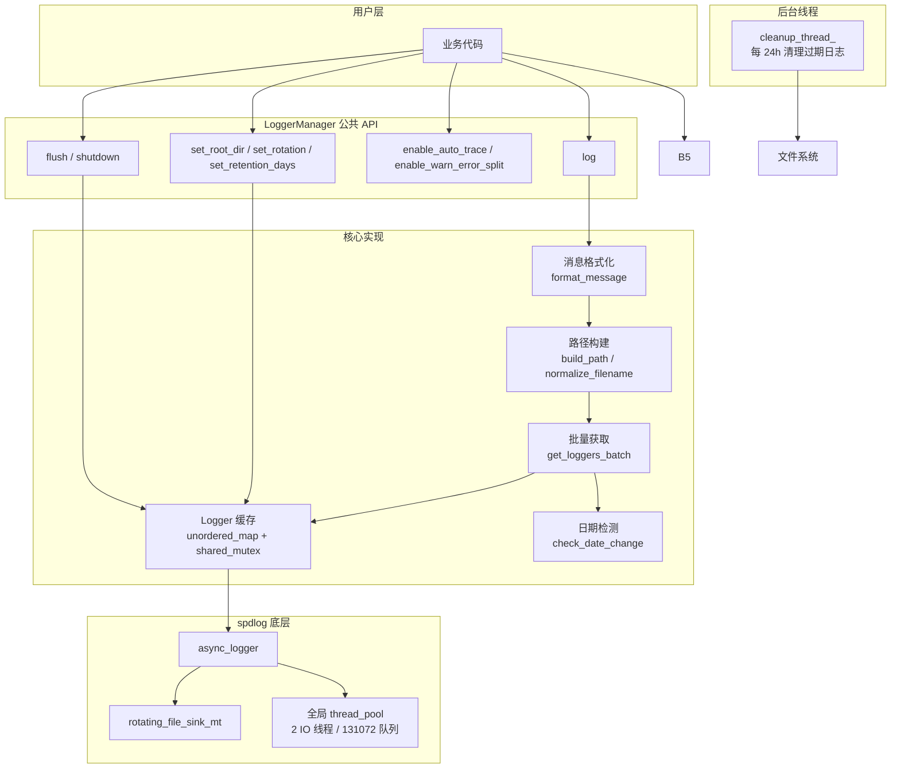
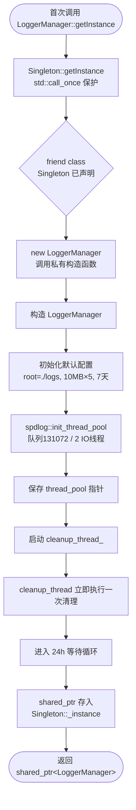
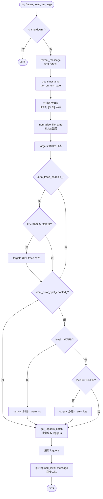
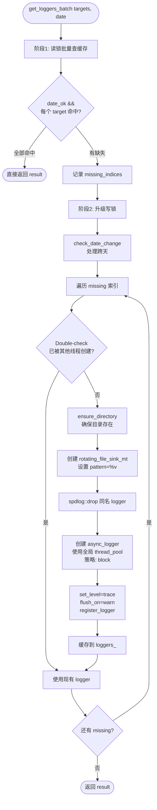
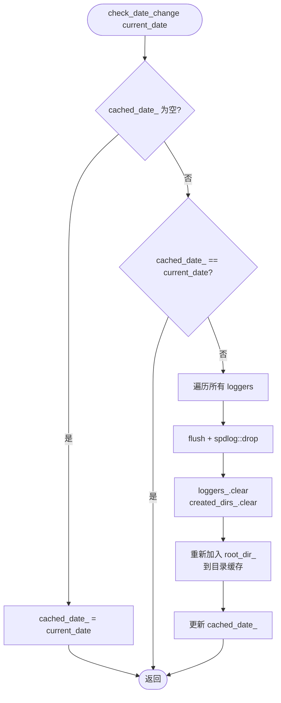
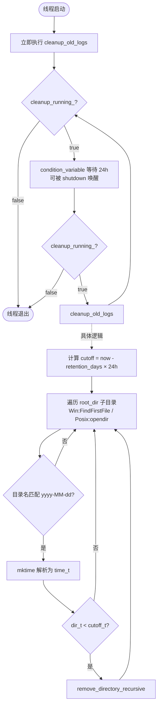
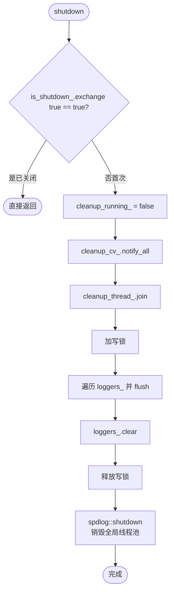
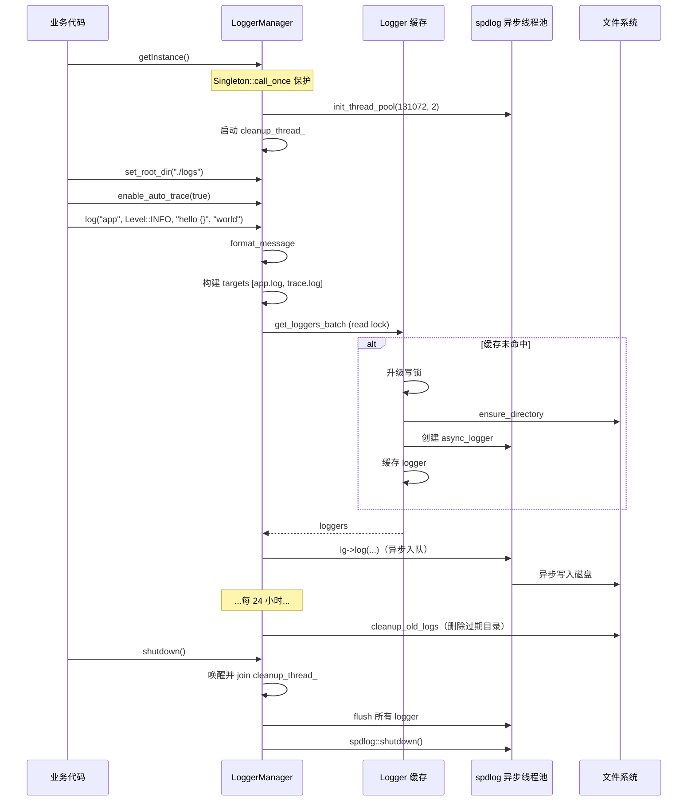

# LoggerManager 实现文档

**开发信息**：
- 开发人员：Simon
- 开发时间：2026-05-19

## 1. 概述

`LoggerManager` 是基于 [spdlog](https://github.com/gabime/spdlog) 封装的高性能、线程安全日志管理器。核心目标：

- **单例**：通过继承通用 `Singleton<LoggerManager>` 模板（CRTP）实现，进程内统一管理 logger 缓存与异步线程池
- **异步高并发**：使用 spdlog 异步线程池，满足 1000+ 并发连接场景
- **按日期分目录**：每天自动切换目录，自动检测日期变化
- **大小回滚**：基于 `rotating_file_sink_mt` 按文件大小回滚
- **自动清理**：后台线程按保留天数定时清理过期日志目录
- **跨平台**：Windows / Linux / macOS 通过条件编译适配

---

## 2. 架构设计

### 2.1 模块组成



### 2.2 关键数据成员

| 成员 | 类型 | 说明 |
|------|------|------|
| `root_dir_` | `std::string` | 日志根目录（默认 `./logs`） |
| `max_file_size_` | `size_t` | 单文件最大字节数（默认 10MB） |
| `max_files_` | `size_t` | 回滚保留文件数（默认 5） |
| `retention_days_` | `int` | 日志保留天数（默认 7） |
| `trace_filename_` | `std::string` | 汇总 trace 日志文件名 |
| `auto_trace_enabled_` | `atomic<bool>` | 是否启用自动 trace 汇总 |
| `warn_error_split_enabled_` | `atomic<bool>` | 是否启用 warn/error 分离 |
| `is_shutdown_` | `atomic<bool>` | 是否已关闭 |
| `loggers_` | `unordered_map<string, shared_ptr<spdlog::logger>>` | logger 缓存（key=完整路径） |
| `logger_mtx_` | `shared_mutex` | 保护 `loggers_` / 配置项 |
| `created_dirs_` | `unordered_set<string>` | 已创建目录缓存，避免重复 mkdir |
| `cached_date_` | `std::string` | 当前日期缓存 `yyyy-MM-dd` |
| `thread_pool_` | `shared_ptr<thread_pool>` | spdlog 全局异步线程池 |
| `cleanup_thread_` | `std::thread` | 后台清理线程 |

---

## 3. 核心流程

### 3.1 单例初始化流程

通过继承 `Singleton<LoggerManager>` 模板，单例创建由父类 `getInstance()` 统一管理（基于 `std::call_once`），LoggerManager 自身只负责构造函数中的初始化逻辑。



**与原 Meyers' Singleton 实现的区别**：
- **原实现**：`static LoggerManager& instance() { static LoggerManager inst; return inst; }`，返回引用
- **新实现**：继承 `Singleton<LoggerManager>`，返回 `std::shared_ptr<LoggerManager>`
- **线程安全保证**：从静态局部变量自动线程安全 → `std::call_once` 显式保证
- **生命周期**：从静态局部变量自动析构 → `shared_ptr` 引用计数管理

详见 [Singleton 实现文档](./Singleton实现文档.md)。

### 3.2 写日志流程（log 方法）

这是最核心的写入流程：



**关键设计**：
- 时间戳和级别由调用方自行格式化为字符串，sink 模板 `set_pattern("%v")` 仅输出原始消息，避免 spdlog 二次格式化开销
- 多目标（主 + trace + warn/error）一次性收集后通过 `get_loggers_batch()` 批量获取，减少锁次数
- 写入是异步入队，不会阻塞调用线程（队列满时根据策略 `block`，保证不丢数据）

### 3.3 批量获取 Logger 流程（get_loggers_batch）

这是高并发性能优化的核心：



**性能要点**：
- **读写锁**：`std::shared_mutex` 允许多线程并发读取缓存，零争用
- **快速路径**：缓存命中时只走读锁
- **慢速路径**：仅在 logger 不存在时获取写锁
- **批量化**：一次调用处理多个目标，一次锁获取
- **Double-check**：写锁内再次检查，防止其他线程已创建

### 3.4 日期切换流程（check_date_change）



**说明**：每次写日志都会调用 `get_current_date()`，跨天后旧 logger 全部释放，新 logger 写入新日期目录。

### 3.5 后台清理流程（cleanup_thread_func）



**说明**：使用 `condition_variable::wait_for(24h)` 而非 `sleep`，确保 `shutdown()` 时能立即唤醒退出。

### 3.6 关闭流程（shutdown）



**调用时机**：进程退出前显式调用；析构函数也会兜底调用一次。

---

## 4. 关键实现细节

### 4.1 文件名规范化

```cpp
normalize_filename("debug")     -> "debug.log"
normalize_filename("debug.log") -> "debug.log"
normalize_filename("")          -> "default.log"

insert_suffix("debug.log", "_warn") -> "debug_warn.log"
```

### 4.2 路径构建

最终路径格式：

```
<root_dir>/<yyyy-MM-dd>/<filename>.log
```

Windows 下统一使用 `\` 分隔符，避免 MinGW CRT 在混合分隔符路径上 `fopen` 失败导致 spdlog 抛异常。

### 4.3 跨平台目录创建

`ensure_directory()` 逐层 `_mkdir`/`mkdir`，支持递归创建。已创建路径缓存于 `created_dirs_`，跨天时清空（保留 root）。

### 4.4 异常安全

`get_or_create_logger` 和 `get_loggers_batch` 内部 `try/catch` 包裹 sink 创建，单个 logger 失败仅打印 stderr 并返回 nullptr，**不会导致整个进程崩溃**。

### 4.5 线程安全保证

| 操作 | 锁策略 |
|------|--------|
| 读取 logger 缓存 | `shared_lock`（读锁） |
| 创建/释放 logger | `unique_lock`（写锁） |
| 配置变更（`set_*`） | `unique_lock`（写锁） |
| 原子开关（`enable_*`） | `atomic + memory_order_relaxed` |
| 关闭标志 | `atomic + exchange` |
| 清理线程同步 | `mutex + condition_variable` |

---

## 5. 性能优化要点

| 优化点 | 实现 | 收益 |
|--------|------|------|
| 异步写入 | spdlog `async_logger` + 全局线程池 | 不阻塞业务线程 |
| 读写锁 | `std::shared_mutex` | 多读零争用 |
| 批量获取 | `get_loggers_batch` | 减少锁次数 N→1 |
| logger 缓存 | `unordered_map` 按完整路径缓存 | 避免重复创建 |
| 目录缓存 | `unordered_set` 缓存已创建目录 | 减少 mkdir 系统调用 |
| 自定义格式 | sink `pattern=%v` + 自行格式化 | 避免 spdlog 二次格式化 |
| `flush_on=warn` | 仅 WARN 及以上自动刷盘 | 减少 IO，关键日志不丢 |
| 满队列 `block` 策略 | 不丢数据 | 高负载下保证完整性 |

---

## 6. 测试与运行流程



---

## 7. 输出文件结构

启用所有功能后：

```
logs/
├── 2026-05-13/
│   ├── app.log              # 业务主日志
│   ├── app.1.log            # 回滚历史 1
│   ├── ...
│   ├── app.5.log            # 回滚历史 5（最旧）
│   ├── app_warn.log         # WARN 分离
│   ├── app_error.log        # ERROR 分离
│   └── trace.log            # 全部日志汇总
├── 2026-05-12/
└── 2026-05-06/              # 7 天前的目录将被自动清理
```

每条日志行格式：

```
[2026-05-13 09:01:23] [INFO] hello world
```

---

## 8. 已知约束

1. **仅按日期分目录**：不支持按小时分目录
2. **format_message 简化实现**：仅支持 `{}` 顺序替换，不支持 `{0}`、`{:5d}` 等高级格式说明符
3. **回滚历史不跨天保留**：跨天后新建文件，旧目录中的回滚链独立
4. **清理粒度为目录级**：必须严格匹配 `yyyy-MM-dd` 格式才会被识别和清理
5. **日期边界**：跨天时下一次写入才触发 `check_date_change`，不依赖定时器

---

## 9. 依赖

- C++17（`std::shared_mutex`、fold expression、`if constexpr` 等）
- spdlog（异步日志库）
- 平台头：`<windows.h>` / `<sys/stat.h>` + `<dirent.h>`
