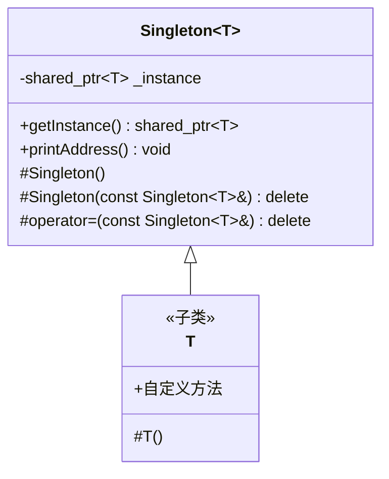
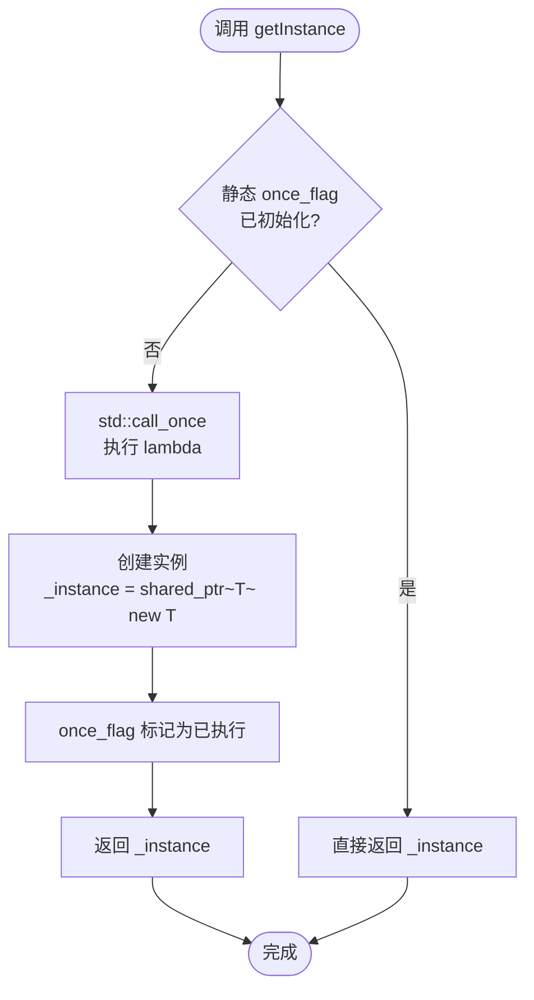
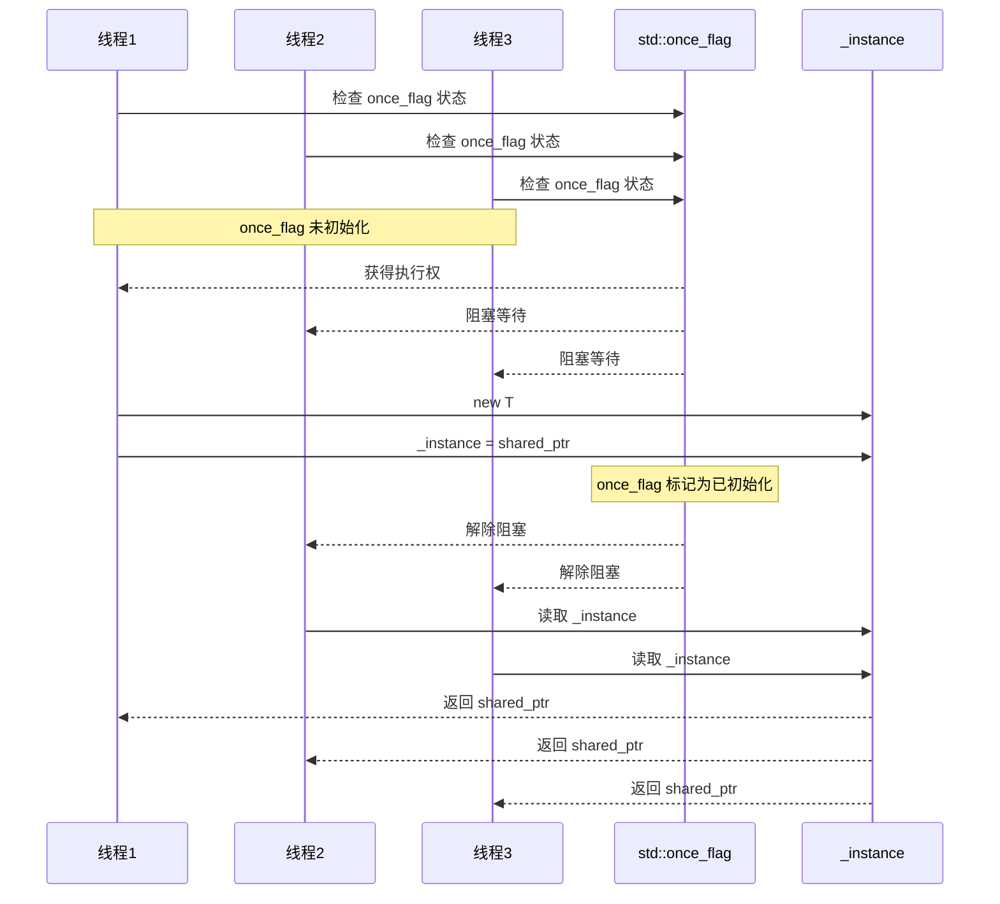
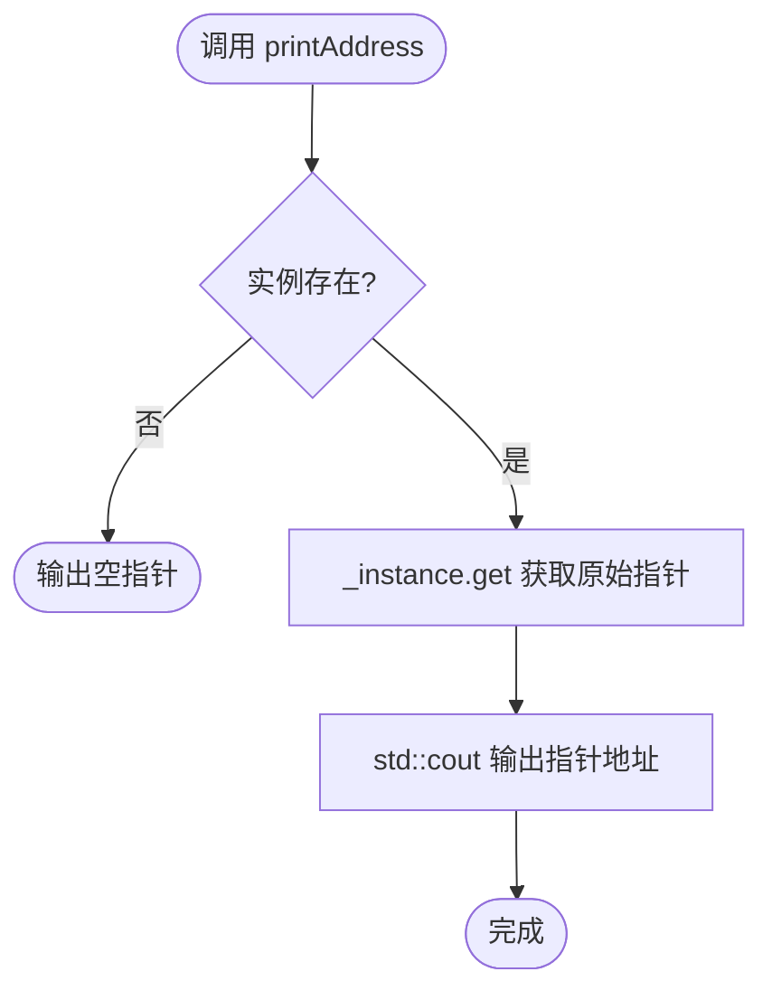
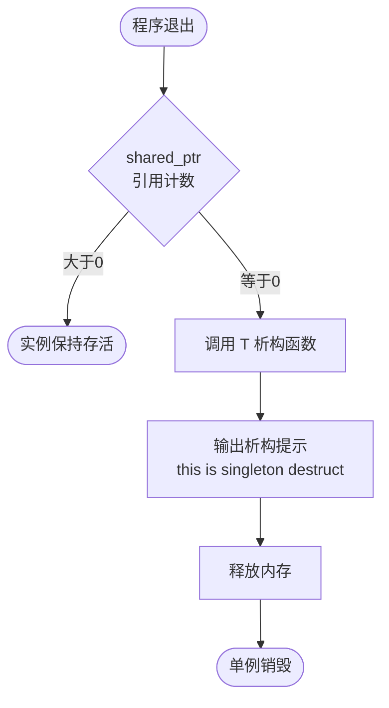
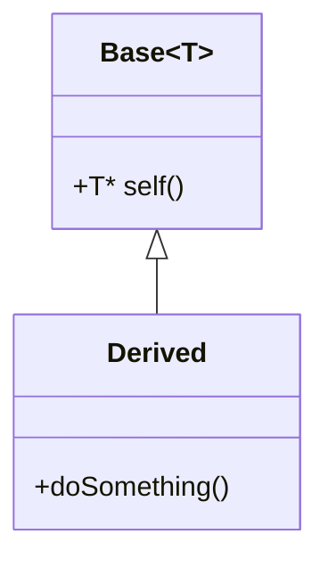
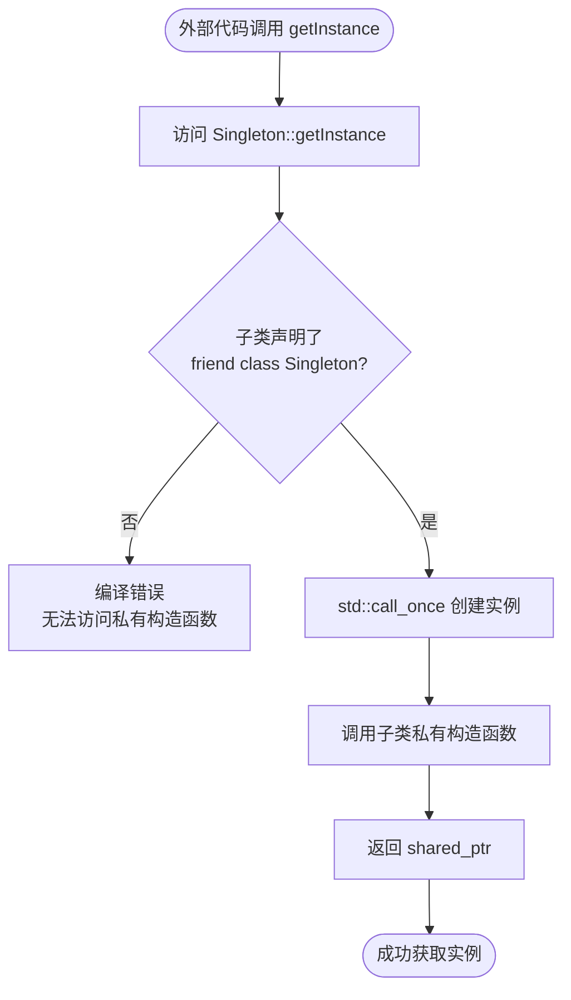
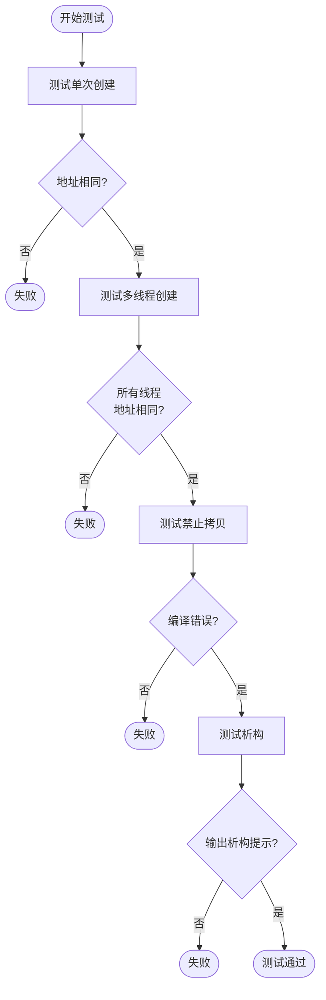

# Singleton 模板实现文档

**开发信息**：
- 开发人员：Simon
- 开发时间：2026-05-19

## 1. 概述

`Singleton` 是一个通用的线程安全单例模板类，使用 C++11 的 `std::call_once` 机制确保多线程环境下只创建一个实例。核心目标：

- **线程安全**：基于 `std::call_once` 保证实例只创建一次
- **智能指针管理**：使用 `std::shared_ptr` 自动管理生命周期
- **通用模板**：适用于任何类型的单例需求
- **禁止复制**：删除拷贝构造和赋值运算符，防止意外复制

---

## 2. 架构设计

### 2.1 模板结构



### 2.2 关键成员

| 成员 | 类型 | 说明 |
|------|------|------|
| `_instance` | `static shared_ptr<T>` | 静态成员变量，存储单例实例指针 |
| 构造函数 | `protected` | 防止外部直接实例化 |
| 拷贝构造 | `delete` | 禁止拷贝 |
| 赋值运算符 | `delete` | 禁止赋值 |

---

## 3. 核心流程

### 3.1 首次获取实例流程



### 3.2 多线程并发获取流程



**关键点**：
- `std::call_once` 保证 lambda 只执行一次
- 其他线程会阻塞等待初始化完成
- 初始化完成后，后续调用直接返回实例，无锁开销

### 3.3 打印地址流程



### 3.4 析构流程



---

## 4. 实现细节

### 4.1 静态成员初始化

```cpp
template <typename T>
std::shared_ptr<T> Singleton<T>::_instance = nullptr;
```

- `_instance` 是静态成员变量，在程序启动时初始化为 `nullptr`
- 所有模板实例共享同一个静态成员

### 4.2 线程安全机制

```cpp
static std::once_flag s_flag;  // 局部静态变量
std::call_once(s_flag, [&]() {
    _instance = shared_ptr<T>(new T);
});
```

**`std::once_flag` 特性**：
- 局部静态变量，函数内唯一
- 保证 `std::call_once` 只执行一次
- 线程安全，内部使用原子操作

**`std::call_once` 特性**：
- 多线程竞争时，只有一个线程执行 lambda
- 其他线程阻塞等待
- 执行完成后，后续调用直接跳过

### 4.3 智能指针管理

```cpp
_instance = shared_ptr<T>(new T);
```

- 使用 `shared_ptr` 管理实例生命周期
- 引用计数机制，最后一个持有者销毁时释放
- 防止内存泄漏

### 4.4 禁止复制

```cpp
Singleton(const Singleton<T>&) = delete;
Singleton& operator=(const Singleton<T>& st) = delete;
```

- 删除拷贝构造函数
- 删除赋值运算符
- 编译期检查，防止意外复制

---

## 5. 使用模式

### 5.1 标准继承模式

```cpp
class MyClass : public Singleton<MyClass> {
    friend class Singleton<MyClass>;  // 必须声明友元
    
private:
    MyClass() { /* 构造逻辑 */ }
    
public:
    void DoSomething() { /* 业务逻辑 */ }
};
```

**关键点**：
- 必须声明 `friend class Singleton<MyClass>`
- 构造函数必须为 `private` 或 `protected`
- 子类提供默认构造函数

#### 奇异递归模板模式（CRTP）

`class MyClass : public Singleton<MyClass>` 使用的是**奇异递归模板模式**（Curiously Recurring Template Pattern, CRTP）。

**什么是 CRTP？**

CRTP 是一种 C++ 惯用模式，子类在继承父类时，将自己作为模板参数传递给父类：

```cpp
template <typename T>
class Base {
    // ...
};

class Derived : public Base<Derived> {
    // 子类将自己作为模板参数
};
```

**CRTP 的工作原理**：



1. **模板实例化**：`Base<Derived>` 被实例化时，模板参数 `T` 被替换为 `Derived`
2. **类型安全**：基类可以知道派生类的类型
3. **编译期多态**：在编译期解析类型，无需虚函数开销

**在 Singleton 模板中的应用**：

```cpp
template <typename T>
class Singleton {
    static std::shared_ptr<T> getInstance() {
        // 这里的 T 在编译期被替换为具体的子类类型
        _instance = shared_ptr<T>(new T);
        return _instance;
    }
};

class MyClass : public Singleton<MyClass> {
    // Singleton<MyClass> 被实例化，T = MyClass
};

class Database : public Singleton<Database> {
    // Singleton<Database> 被实例化，T = Database
};
```

**CRTP 的优势**：

| 特性 | 虚函数多态 | CRTP |
|------|-----------|------|
| 运行时开销 | 虚表查找 | 无（编译期解析） |
| 类型安全 | 基类指针 | 编译期确定具体类型 |
| 内存开销 | 虚表指针 | 无额外开销 |
| 适用场景 | 运行时多态 | 静态多态、类型特定行为 |

**CRTP 在 Singleton 中的作用**：

1. **类型隔离**：每个子类 `MyClass`、`Database` 都有自己独立的静态成员 `_instance`
   ```cpp
   Singleton<MyClass>::_instance     // MyClass 的实例
   Singleton<Database>::_instance    // Database 的实例
   ```

2. **类型安全**：`getInstance()` 返回正确的类型
   ```cpp
   auto my = MyClass::getInstance();      // 类型: shared_ptr<MyClass>
   auto db = Database::getInstance();     // 类型: shared_ptr<Database>
   ```

3. **代码复用**：单例逻辑在模板中实现一次，所有子类共享

**其他 CRTP 应用场景**：

```cpp
// 1. 静态多态（模拟虚函数）
template <typename T>
class Shape {
public:
    void draw() { static_cast<T*>(this)->drawImpl(); }
};

class Circle : public Shape<Circle> {
public:
    void drawImpl() { /* 绘制圆形 */ }
};

// 2. 单例模式
template <typename T>
class Singleton { /* ... */ };

// 3. 混入（Mixin）
template <typename T>
class Serializable {
public:
    void serialize() { static_cast<T*>(this)->doSerialize(); }
};
```

#### 为什么需要友元声明？

`friend class Singleton<MyClass>` 的作用是**允许 Singleton 模板类访问子类的私有构造函数**。

**原理说明**：

1. **构造函数私有化**：为了防止外部直接创建实例，子类的构造函数必须声明为 `private`

2. **Singleton 需要调用构造函数**：Singleton 模板在 `getInstance()` 中通过 `new T` 创建实例，这需要调用子类 `T` 的构造函数

3. **访问权限冲突**：
   - 子类构造函数是 `private`，外部（包括父类）无法访问
   - Singleton 模板作为父类，默认无法访问子类的私有成员

4. **友元解决冲突**：
   - 声明 `friend class Singleton<MyClass>` 后，Singleton 模板获得访问子类私有构造函数的权限
   - 这样 Singleton 可以在 `getInstance()` 中安全地调用 `new T`

**示例对比**：

```cpp
// 错误示例（无友元声明）
class MyClass : public Singleton<MyClass> {
private:
    MyClass() {}  // 私有构造函数
};
// 编译错误：Singleton 无法访问 MyClass 的私有构造函数

// 正确示例（有友元声明）
class MyClass : public Singleton<MyClass> {
    friend class Singleton<MyClass>;  // 允许 Singleton 访问私有成员
private:
    MyClass() {}  // 私有构造函数
};
// 编译通过：Singleton 可以访问并创建实例
```

**设计权衡**：
- **优点**：强制外部必须通过 `getInstance()` 获取实例，防止滥用
- **代价**：每个子类都需要显式声明友元，增加样板代码
- **替代方案**：使用 `protected` 构造函数，但安全性稍弱

### 5.2 访问控制流程



---

## 6. 与其他单例模式对比

### 6.1 实现方式对比

| 特性 | Singleton 模板 | Meyers' Singleton | 懒汉式（锁） | 饿汉式 |
|------|----------------|-------------------|--------------|--------|
| 实现方式 | `call_once` + `shared_ptr` | 静态局部变量 | `mutex` + 懒加载 | 静态全局变量 |
| 线程安全 | 是 | 是（C++11+） | 是 | 是 |
| 初始化时机 | 首次调用 | 首次调用 | 首次调用 | 程序启动 |
| 性能 | 首次有锁，后续无锁 | 无锁 | 每次加锁 | 无锁 |
| 内存管理 | `shared_ptr` 自动 | 自动 | 手动 | 自动 |
| 适用场景 | 通用模板 | 简单单例 | 旧代码兼容 | 需要立即初始化 |

### 6.2 代码对比

**Singleton 模板**：
```cpp
class MyClass : public Singleton<MyClass> {
    friend class Singleton<MyClass>;
private:
    MyClass() = default;
};
auto instance = MyClass::getInstance();
```

**Meyers' Singleton**：
```cpp
class MyClass {
private:
    MyClass() = default;
public:
    static MyClass& instance() {
        static MyClass inst;
        return inst;
    }
};
auto& instance = MyClass::instance();
```

**懒汉式（锁）**：
```cpp
class MyClass {
private:
    static std::mutex mtx;
    static MyClass* instance;
    MyClass() = default;
public:
    static MyClass* getInstance() {
        if (!instance) {
            std::lock_guard<std::mutex> lock(mtx);
            if (!instance) {
                instance = new MyClass();
            }
        }
        return instance;
    }
};
```

---

## 7. 性能分析

### 7.1 时间复杂度

| 操作 | 首次调用 | 后续调用 |
|------|----------|----------|
| `getInstance()` | O(1) + 锁等待 | O(1) 无锁 |
| `printAddress()` | O(1) | O(1) |
| 析构 | O(1) | O(1) |

### 7.2 空间复杂度

- **模板实例化**：每个类型 T 生成一份代码
- **静态成员**：每个类型 T 一个 `_instance` 指针
- **运行时开销**：`sizeof(shared_ptr<T>)` + `sizeof(T)`

### 7.3 性能优化

- **局部静态 `once_flag`**：避免全局静态变量初始化顺序问题
- **`call_once` 后无锁**：后续调用无锁开销
- **`shared_ptr` 引用计数**：原子操作，性能优于手动管理

---

## 8. 已知限制

1. **需要默认构造函数**：子类必须提供无参构造函数，不支持带参数的单例
2. **友元声明**：每个子类必须显式声明 `friend class Singleton<T>`
3. **析构顺序**：多单例析构顺序由编译器决定，可能存在依赖问题
4. **模板膨胀**：每个类型 T 生成一份代码，增加二进制体积
5. **不支持继承链**：不能多层继承 Singleton

---

## 9. 测试与验证

### 9.1 单元测试流程



### 9.2 示例测试代码

```cpp
#include "singleton/singleton.h"
#include <thread>
#include <vector>
#include <cassert>

class TestClass : public Singleton<TestClass> {
    friend class Singleton<TestClass>;
private:
    TestClass() {}
};

void test_single_instance() {
    auto p1 = TestClass::getInstance();
    auto p2 = TestClass::getInstance();
    assert(p1 == p2);
    assert(p1.get() == p2.get());
}

void test_multithread() {
    std::vector<std::shared_ptr<TestClass>> ptrs;
    std::vector<std::thread> threads;
    
    for (int i = 0; i < 100; ++i) {
        threads.emplace_back([&ptrs]() {
            ptrs.push_back(TestClass::getInstance());
        });
    }
    
    for (auto& t : threads) {
        t.join();
    }
    
    // 验证所有指针相同
    for (size_t i = 1; i < ptrs.size(); ++i) {
        assert(ptrs[0] == ptrs[i]);
        assert(ptrs[0].get() == ptrs[i].get());
    }
}

int main() {
    test_single_instance();
    test_multithread();
    std::cout << "All tests passed!" << std::endl;
    return 0;
}
```

---

## 10. 依赖

- C++11 或更高版本（`std::once_flag`、`std::call_once`、`std::shared_ptr`）
- 标准库：`<memory>`、`<mutex>`、`<iostream>`
