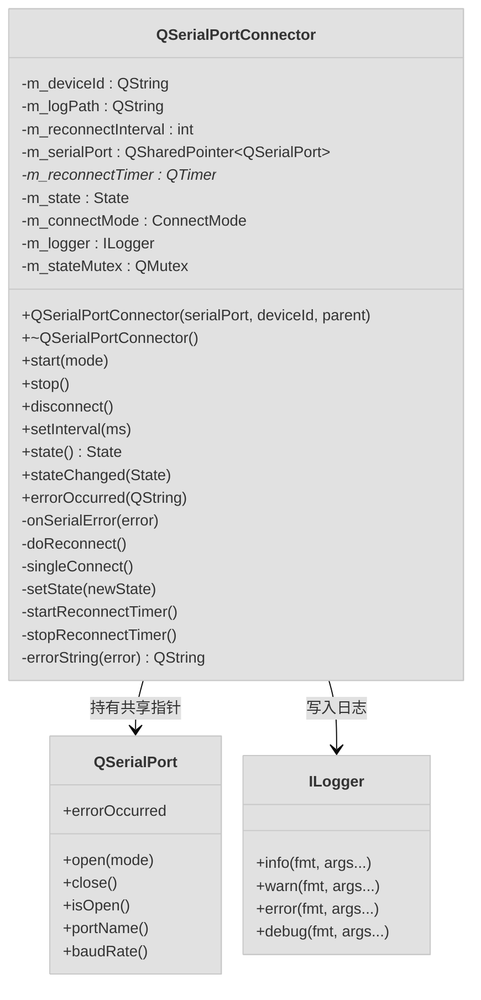
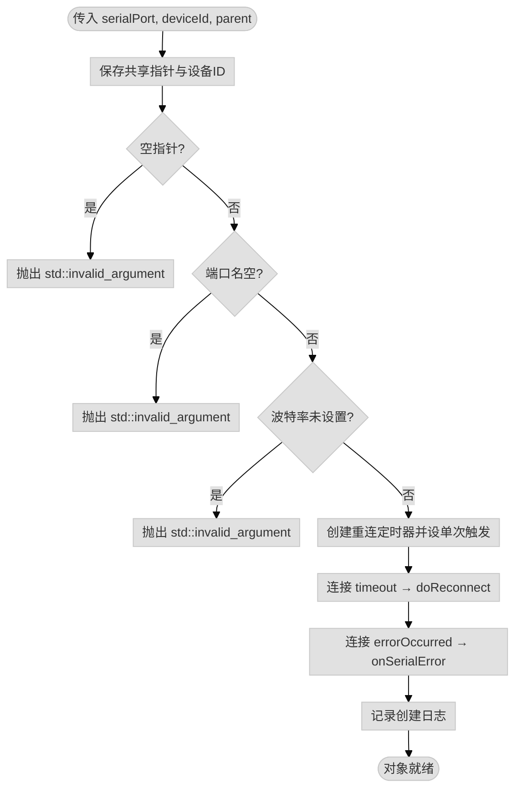
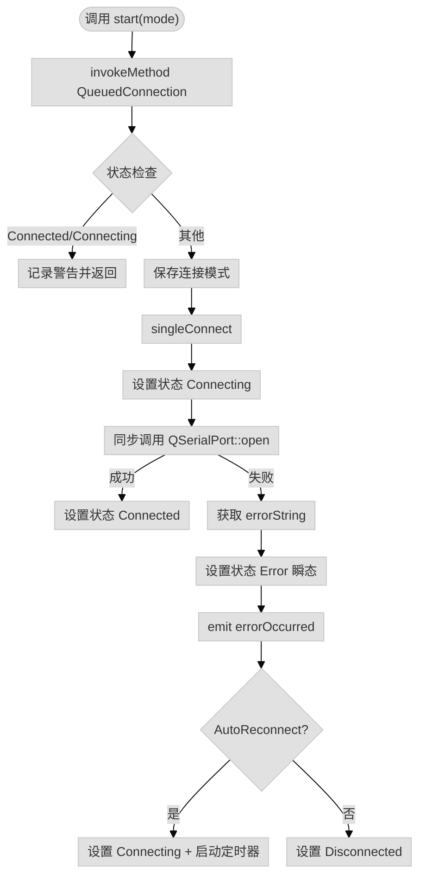
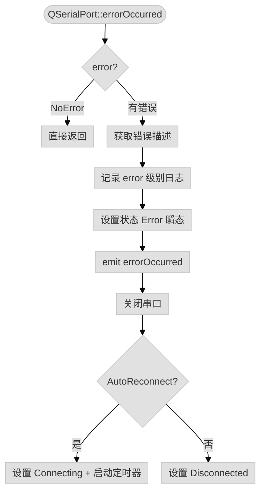
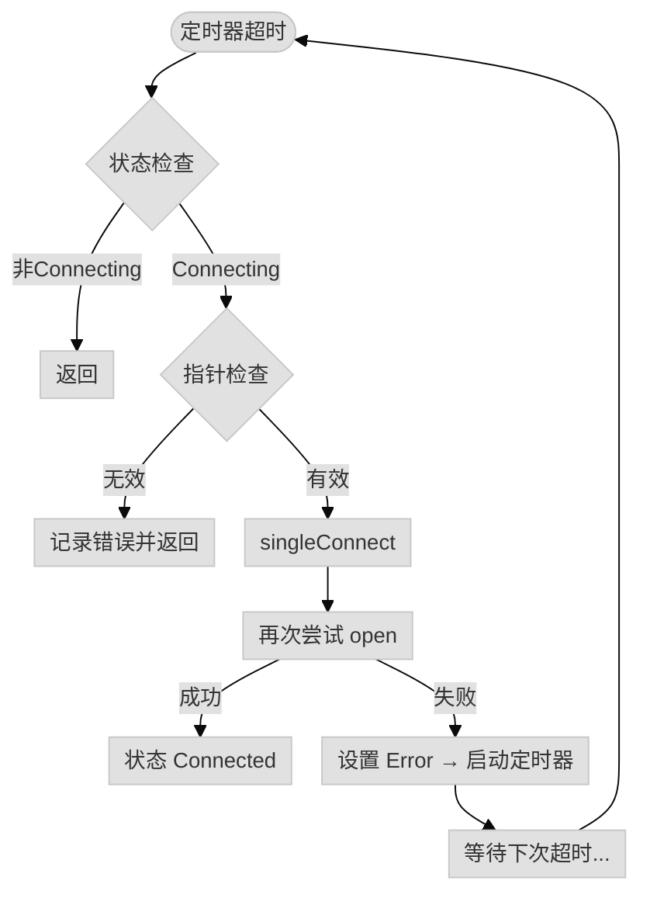
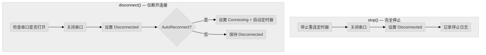
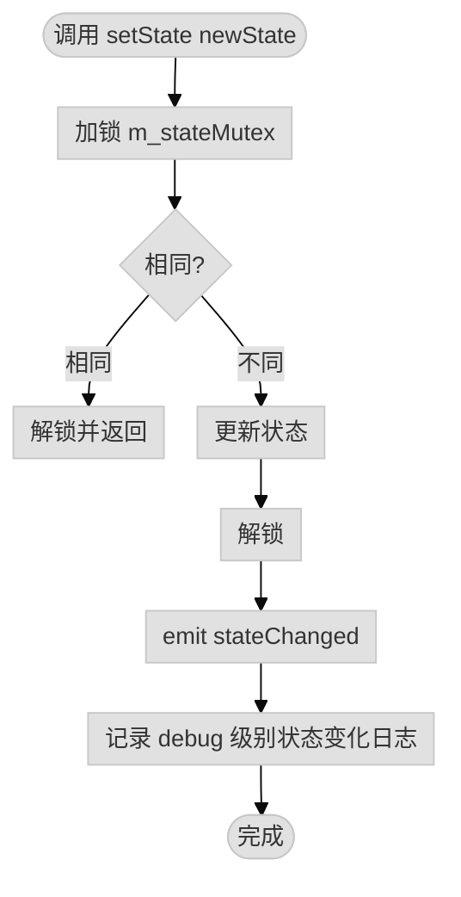

# QSerialPortConnector 实现文档

**开发信息**：
- 开发人员：李卓
- 开发时间：2026-05-21

## 1. 概述

`QSerialPortConnector` 是基于 Qt `QSerialPort` 的串口连接管理类，提供串口连接的自动重连、状态监控、错误处理、日志记录等功能。核心目标：

- **连接生命周期管理**：封装串口的打开、关闭、重连逻辑
- **状态机驱动**：通过明确的状态流转管理连接过程
- **线程安全**：关键状态操作通过 `QMetaObject::invokeMethod` 排队到对象线程执行
- **模块化日志**：每个连接器实例绑定独立日志文件
- **零耦合数据层**：不负责数据读写，只管理连接生命周期

---

## 2. 架构设计

### 2.1 类结构



### 2.2 关键成员

| 成员 | 类型 | 说明 |
|------|------|------|
| `m_deviceId` | `QString` | 设备唯一标识，用于日志区分 |
| `m_logPath` | `QString` | 日志文件路径，格式 `connector/connector_<deviceId>` |
| `m_reconnectInterval` | `int` | 重连间隔，默认 5000ms |
| `m_serialPort` | `QSharedPointer<QSerialPort>` | 串口对象共享指针，外部创建并配置 |
| `m_reconnectTimer` | `QTimer*` | 单次触发定时器，控制重连节奏 |
| `m_state` | `State` | 当前连接状态（受 `m_stateMutex` 保护） |
| `m_connectMode` | `ConnectMode` | 连接模式：自动重连 / 单次连接 |
| `m_logger` | `ILogger` | 模块化日志实例 |
| `m_stateMutex` | `QMutex` | 保护 `m_state` 读写线程安全 |

---

## 3. 核心流程

### 3.1 构造函数流程



**关键点**：

- 构造函数在初始化列表中完成所有成员初始化
- 参数校验失败直接抛异常，确保对象始终处于有效状态
- 定时器设为 `SingleShot`，每次超时后需重新 `start()`

### 3.2 启动连接流程



### 3.3 串口错误处理流程



**关键点**：
- `Error` 状态仅用于日志记录，不停留，立即流转到 `Connecting` 或 `Disconnected`
- 错误发生后必须先关闭串口，再决定后续动作

### 3.4 自动重连流程



### 3.5 停止与断开流程



**区别**：
- `stop()`：彻底停止，关闭串口 + 停止定时器，不再重连
- `disconnect()`：主动断开，但保留重连机制（AutoReconnect 模式下）

### 3.6 状态设置流程



**关键点**：
- 使用 `QMutexLocker` RAII 管理锁，异常安全
- 状态重复时直接返回，避免无意义信号发射
- 信号发射在锁外进行，防止死锁

---

## 4. 实现细节

### 4.1 线程安全设计

```cpp
void QSerialPortConnector::start(ConnectMode mode)
{
    // 所有公共接口均通过 invokeMethod 排队到对象线程执行
    QMetaObject::invokeMethod(this, [this, mode]() {
        // ... 实际逻辑
    }, Qt::QueuedConnection);
}
```

**技术要点**：
- **QueuedConnection**：确保槽函数在对象所属线程执行
- **状态读保护**：`state()` 使用 `QMutexLocker` 保护读操作
- **信号安全**：`setState()` 中信号发射在解锁后进行

### 4.2 状态机设计

```
Disconnected --start()--> Connecting --open成功--> Connected
                                    --open失败--> Error(瞬态) --> Connecting(定时器重试)
                                                                    --> Disconnected(单次模式)

Connected --onSerialError--> Error(瞬态) --> Connecting(定时器重试)
                                          --> Disconnected(单次模式)

Connected/Connecting --stop()--> Disconnected

Connected --disconnect()--> Disconnected --AutoReconnect--> Connecting(定时器)
```

**设计考虑**：
- `Error` 为瞬态状态，仅用于日志和信号，不停留
- `Connecting` 状态覆盖首次连接和重连场景
- 状态转换通过 `setState()` 统一入口，确保日志和信号一致性

### 4.3 重连定时器机制

```cpp
// 构造函数中设为单次触发
m_reconnectTimer->setSingleShot(true);

// 启动时
void QSerialPortConnector::startReconnectTimer()
{
    m_reconnectTimer->start(m_reconnectInterval);
}

// 超时后自动停止，触发 doReconnect()
// doReconnect() 中再次调用 singleConnect()
// 失败则再次 startReconnectTimer()
```

**设计考虑**：
- 单次触发避免定时器持续运行
- 每次重连失败重新启动，实现固定间隔重试
- `doReconnect()` 安全检查防止状态已改变时的误触发

### 4.4 错误码映射

```cpp
QString QSerialPortConnector::errorString(QSerialPort::SerialPortError error) const
{
    switch (error) {
    case QSerialPort::DeviceNotFoundError:  return "Device not found";
    case QSerialPort::PermissionError:      return "Permission denied";
    case QSerialPort::OpenError:            return "Failed to open device";
    case QSerialPort::ParityError:          return "Parity error";
    case QSerialPort::FramingError:         return "Framing error";
    case QSerialPort::BreakConditionError:  return "Break condition";
    case QSerialPort::WriteError:           return "Write error";
    case QSerialPort::ReadError:            return "Read error";
    case QSerialPort::ResourceError:        return "Resource error";
    case QSerialPort::UnsupportedOperationError: return "Unsupported operation";
    case QSerialPort::UnknownError:         return "Unknown error";
    case QSerialPort::TimeoutError:         return "Timeout";
    case QSerialPort::NotOpenError:         return "Device not open";
    default:                                return "Unknown error";
    }
}
```

**技术要点**：

- 将 Qt 枚举转换为可读英文描述
- 统一错误描述格式，便于日志分析和国际化扩展

### 4.5 日志路径设计

```cpp
// 构造函数中
m_logPath("connector/connector_" + deviceId)

// 生成路径示例：
// deviceId = "PLC_01" → "connector/connector_PLC_01"
// LoggerManager 会自动补全 .log 后缀
```

**设计考虑**：
- 按模块分类：`connector/` 目录存放所有连接模块日志
- 按设备区分：`connector_<deviceId>` 区分多设备场景
- 与 `ILogger` 配合，实现模块化独立日志文件

---

## 5. 使用模式

### 5.1 标准使用模式

```cpp
// 1. 外部创建并配置 QSerialPort
QSharedPointer<QSerialPort> serial(new QSerialPort());
serial->setPortName("COM3");
serial->setBaudRate(QSerialPort::Baud9600);
serial->setDataBits(QSerialPort::Data8);
serial->setParity(QSerialPort::NoParity);
serial->setStopBits(QSerialPort::OneStop);

// 2. 创建连接器（构造函数会校验参数）
QSerialPortConnector* connector = new QSerialPortConnector(serial, "PLC_01", this);

// 3. 监听状态变化
connect(connector, &QSerialPortConnector::stateChanged, this, [](auto state) {
    qDebug() << "State:" << static_cast<int>(state);
});

// 4. 启动自动重连
connector->start(QSerialPortConnector::ConnectMode::AutoReconnect);

// 5. 停止时自动清理
// delete connector;  // 析构调用 stop()
```

---

## 6. 性能分析

### 6.1 时间复杂度

| 操作 | 时间复杂度 | 说明 |
|------|-----------|------|
| 构造 | O(1) | 参数校验 + 信号连接 |
| start/stop/disconnect | O(1) | invokeMethod 排队 + 状态判断 |
| singleConnect | O(1) | 同步 open()，取决于操作系统串口驱动 |
| state() | O(1) | 加锁读取 |
| setState | O(1) | 加锁 + 信号发射 |
| errorString | O(1) | switch 分支查找 |

### 6.2 空间复杂度

- **实例大小**：约 100-150 字节（含 QString、指针、mutex）
- **额外开销**：`QSerialPort` 由外部管理，本类仅持有共享指针
- **日志开销**：由 `ILogger` 委托 `LoggerManager`，异步写入

---

## 7. 已知限制

1. **同步 open()**：`singleConnect()` 中调用同步 `QSerialPort::open()`，在 Windows 上可能阻塞数百毫秒
3. **无连接超时**：`open()` 本身无超时参数，依赖操作系统实现
4. **串口参数外部配置**：本类不管理波特率、数据位等参数，由外部创建 `QSerialPort` 时设置
5. **无数据读写接口**：本类专注连接管理，数据读写由持有 `m_serialPort` 的外部模块负责

---

## 8. 测试与验证

### 8.1 单元测试示例

```cpp
#include "qserialportconnector.h"
#include <QTest>

class TestQSerialPortConnector : public QObject {
    Q_OBJECT
private slots:
    void test_constructor_validation() {
        // 空指针应抛异常
        QSharedPointer<QSerialPort> nullPtr;
        QVERIFY_EXCEPTION_THROWN(
            new QSerialPortConnector(nullPtr, "test"),
            std::invalid_argument
        );
    }

    void test_state_transition() {
        QSharedPointer<QSerialPort> serial(new QSerialPort());
        serial->setPortName("COM_TEST");  // 虚拟端口名
        serial->setBaudRate(QSerialPort::Baud9600);

        QSerialPortConnector connector(serial, "test");
        QCOMPARE(connector.state(), QSerialPortConnector::State::Disconnected);

        // 启动后状态变为 Connecting（即使端口不存在也会尝试）
        connector.start(QSerialPortConnector::ConnectMode::SingleConnect);
        QTRY_COMPARE(connector.state(), QSerialPortConnector::State::Disconnected);
    }

    void test_stop_clears_state() {
        QSharedPointer<QSerialPort> serial(new QSerialPort());
        serial->setPortName("COM_TEST");
        serial->setBaudRate(QSerialPort::Baud9600);

        QSerialPortConnector connector(serial, "test");
        connector.start();
        connector.stop();

        QCOMPARE(connector.state(), QSerialPortConnector::State::Disconnected);
    }
};

QTEST_MAIN(TestQSerialPortConnector)
#include "test_qserialportconnector.moc"
```

---

## 9. 依赖

- Qt 5.12+ 或 Qt 6.x（`QSerialPort`、`QTimer`、`QSharedPointer`、`QMetaObject`）
- C++11 或更高版本（lambda、`std::invalid_argument`）
- `ILogger` 及其依赖（`LoggerManager`、`spdlog`）
- 标准库：`<stdexcept>`

---

## 10. 扩展方向

### 10.1 支持指数退避重连

```cpp
class QSerialPortConnector {
    int m_reconnectInterval;      // 基础间隔
    int m_currentInterval;      // 当前间隔（指数增长）
    int m_maxInterval;          // 最大间隔上限

    void startReconnectTimer() {
        m_reconnectTimer->start(m_currentInterval);
        m_currentInterval = qMin(m_currentInterval * 2, m_maxInterval);
    }

    void onConnected() {
        m_currentInterval = m_reconnectInterval;  // 重置
    }
};
```

### 10.2 支持连接超时

```cpp
class QSerialPortConnector {
    QTimer* m_connectTimeoutTimer;  // 连接超时定时器

    void singleConnect() {
        m_connectTimeoutTimer->start(3000);  // 3秒超时
        // 异步 open 或在独立线程执行同步 open
    }
};
```

### 10.3 支持连接统计

```cpp
class QSerialPortConnector {
    int m_connectCount;        // 总连接次数
    int m_reconnectCount;    // 重连次数
    QDateTime m_lastConnectTime;  // 上次连接时间

    void singleConnect() {
        m_connectCount++;
        // ...
    }
};
```
